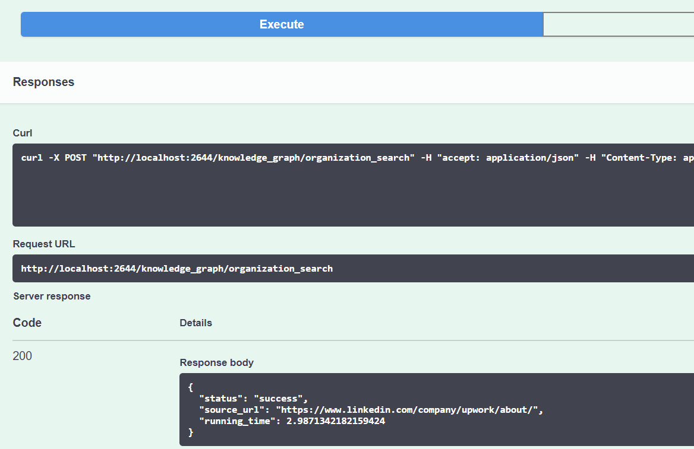

# organization_knowledge_graph_search

### 1. pull the docker from the docker hub

```bash
docker pull ruzeliang/organization_search:1.0.1
```

### 2. run the docker

```bash
docker run -it ^
-p 0.0.0.0:9344:9344 ^
-p 0.0.0.0:3641:3641 ^
-p 0.0.0.0:5611:5611 ^
-p 0.0.0.0:4971:4971 ^
-p 0.0.0.0:2644:9000 ^
ruzeliang/organization_search:1.0.1
```

the docker will start the service of the knowledge graph for search, wait for a few minutes, until you see the following


### 3. open the input interface of FLASK 

http://localhost:2644/

### 4. input the company name you want to search from the knowledge graph


### 5. click "Excute" to search



